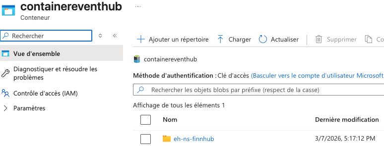
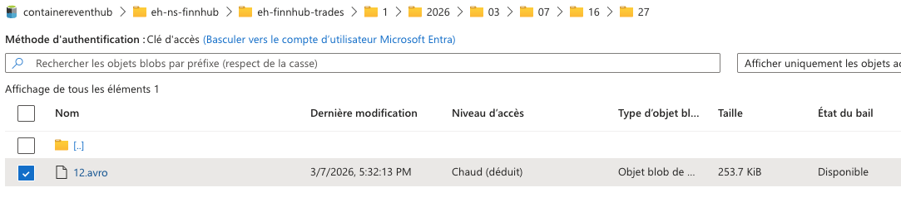

# Ingestion architecture and iterations

This document explains the different ingestion approaches explored to bring Finnhub data into a Databricks-based lakehouse, and why the current HTTP-based approach was chosen given the constraints of the Databricks free edition.

## 1. Event Hubs + Databricks (ideal target architecture)

**Intent:**  
Use Azure Event Hubs as the streaming ingestion layer, with a Databricks Structured Streaming job reading from Event Hubs and writing to a volume and then processed to a Bronze Delta table.

- A Container App connects to the Finnhub WebSocket, receives trades, and produces events into **Azure Event Hubs**.  
- A Databricks Structured Streaming job reads from Event Hubs (using the native Event Hubs connector) and writes directly into a Bronze Delta table.  
- This flow is implemented in `ingestion/exploration_tests/ingestion_finnhub_eventhub.py`.

This would be the **best architecture in a real Databricks workspace** (non‑free edition), where you can use full Event Hubs connectors, secret scopes, and proper cloud integration.[web:786][web:795]  
A short demo of this “proper” architecture will be provided later using an Azure Databricks workspace.

However, with the Databricks **free edition**, we hit limitations around connectivity and supported integrations, so this was not usable end‑to‑end for the current sandbox.[web:787][web:793]

## 2. Event Hubs with Kafka protocol

**Intent:**  
Leverage Azure Event Hubs’ **Kafka protocol compatibility** to treat Event Hubs as a Kafka broker, and use standard Kafka clients for ingestion.[web:781][web:783]

- Azure Event Hubs exposes a Kafka‑compatible endpoint.
- The Finnhub WebSocket consumer produces to Event Hubs using the Kafka protocol.
- Downstream consumers can read using Kafka APIs, while Event Hubs handles partitions, offsets, and consumer groups.

This experiment is implemented in `ingestion/exploration_tests/ingestion_finnhub_kafka.py`.

In practice, although Kafka protocol support in Event Hubs works well in general, combining it with the Databricks free edition’s network and integration limits again made it difficult to complete the full “Event Hubs → Databricks” loop from this environment.[web:782][web:788]

## 3. Event Hubs Capture to ADLS

**Intent:**  
Use **Event Hubs Capture** to automatically land raw events into Azure Data Lake Storage (ADLS) as files, and then load those files from Databricks.[web:786][web:789]

- Event Hubs Capture writes events in batch to ADLS (e.g. parquet / Delta) on a time + size schedule.
- Verified that Capture works: new files were visible in ADLS. 

- A Databricks job (bronze ingestion) would then read these files and write to a Bronze Delta table.

This flow is implemented in `ingestion/exploration_tests/ingestion_finnhub_eventhub_capture.py`.

Technically, this approach worked on the Azure side, but **Databricks free edition** again imposed constraints:

- The free/sandbox environment is primarily for compute, with **limited native access** to cloud storage services (ADLS) and identity/ADFS integration.  
- This made it hard to cleanly mount or access the ADLS location from the free Databricks workspace.[web:787][web:790][web:793]

## 4. HTTP endpoint in Container Apps + polling script (current working approach)

Given the above limitations, the architecture was adapted to remove the direct dependency on Event Hubs and instead:

1. Run a Python **ingestion endpoint** inside an Azure Container App (`ingestion/finnhub-websocket-prod_send`):
   - The app connects to the Finnhub WebSocket.
   - It buffers incoming trades in memory with server‑side timestamps.
   - It exposes an HTTP route, e.g. `/trades?since_ts=...&limit=...`, to retrieve batches of buffered trades.

2. Use a small Python script (scheduled from Databricks or externally) that:
   - Calls the Container App HTTP endpoint every N minutes with two parameters:
     - `since_ts`: the last processed ingestion timestamp.
     - `limit`: max number of buffered messages to fetch.
   - Writes the received trades into storage (e.g. files in a volume or directly into a table).
   - Updates a simple state file to remember the latest `since_ts` and avoid reprocessing.

This script is implemented in `ingestion/ingestion_finnhub.py`.

This HTTP‑based pattern:

- Works within the constraints of **Databricks free edition**, because it only needs outbound HTTPS from the cluster to the Container App URL.  
- Still preserves a near‑streaming ingestion pattern (e.g. job scheduled every 2 minutes with a cursor).  
- Keeps the architecture close to what would be used in a more robust setup (cursor, idempotent ingestion, decoupled producer/consumer).

## Summary

- In a **full Databricks environment**, the first solution (Event Hubs + Structured Streaming → Volume & Delta table) is the preferred and most robust architecture, and a dedicated demo will be built later on a proper Azure Databricks workspace.  
- To keep moving forward and adapt to the limitations of the **Databricks free edition**, the project now uses:
  - An Azure Container App that collects Finnhub WebSocket data and exposes it over HTTP, and  
  - A polling ingestion script (`ingestion/ingestion_finnhub.py`) that pulls data with a cursor and writes it into storage for further processing.
